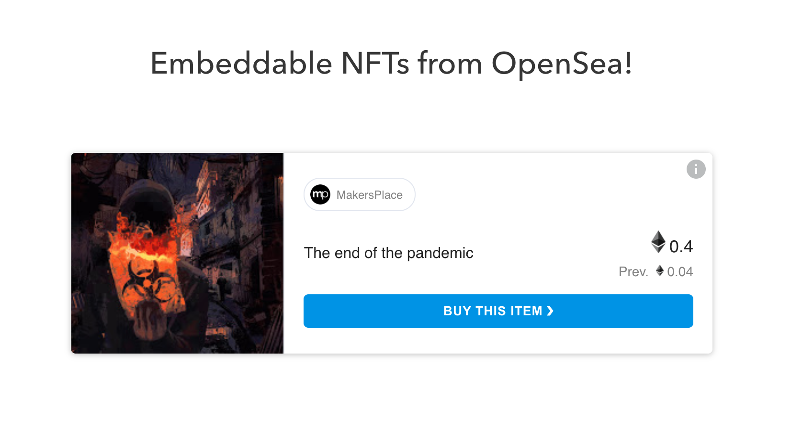

<br /><br />

# Embeddable NFTs

Easily embed OpenSea listings in your website!

### Component inputs

`tokenAddress`\*- The token's contract address.

`tokenId`\* - The token Id of the asset.

`horizontal` - If this is present, the card will be rendered horizontally.
mode on mobile (breakpoint is at 600px). In `manual` mode the card will be unaffected.

`orientationMode` - If `auto` the card will switch to vertical

`width` - The width of the embeddable. Ex. values `100%` `250px`. Default: `388px`

`height` - The height of the embeddable. Ex. values `40vh` `300px`. Default: `560px`

`network` - The name of the network the asset is on `mainnet` or `testnet`. Default: `mainnet`.

`referrerAddress` - The address of the referrer. Check out the [SDK docs](https://github.com/ProjectOpenSea/opensea-js#affiliate-program) to learn more about the Affiliate program.

\*Required inputs

### Usage

Add this to your `<head>` tag:

```
<script src="https://unpkg.com/embeddable-nfts/dist/nft-card.min.js"></script>
```

Then add this into your code:

```
<nft-card
  tokenAddress="0x5caebd3b32e210e85ce3e9d51638b9c445481567"
  tokenId="2242579050293992223"
  network="mainnet"
  referrerAddress="YOUR_ADDRESS_HERE"
  >
</nft-card>
```

### Development

For developers looking to contribute or modify the code, or view the example use the following commands:

```bash
  git clone https://github.com/ProjectOpenSea/embeddable_nfts.git
  cd embeddable_nfts
  yarn install
  yarn run dev:demo
```

#### Development server

This project uses webpack for building and running a development server. Once the server starts, any changes made will trigger a rebuild after which those changes should be reflected in your browser.
